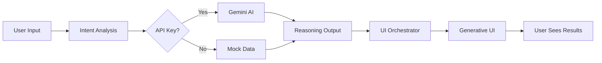

# 🩺 Health Co-Pilot

> **AI-powered ingredient analysis that explains *why* ingredients matter, not just *what* they are.**

An AI-native health product analyzer that reimagines how consumers understand food ingredients through intelligent reasoning rather than raw data dumps.

[](https://nextjs.org/)
[](https://react.dev/)
[](https://www.typescriptlang.org/)
[](https://ai.google.dev/gemini-api)


---

## ✨ Features

### 🎯 **Intent-First Interaction**
- **No forms or filters** - Just paste ingredients or ask a question
- Natural language processing understands context automatically
- Examples: *"Is this safe for pregnancy?"* or *"Does this have added sugar?"*

### 🧠 **AI Reasoning Engine**
- **Explains WHY, not just WHAT** - Every insight includes reasoning
- Translates scientific jargon to plain English
- Shows manufacturer trade-offs and alternatives
- Powered by Google Gemini 2.0 (with intelligent fallback to mock data)

### 🎨 **Generative UI**
- Interface adapts dynamically based on analysis complexity
- Color-coded verdicts (Green = Safe, Orange = Caution, Red = Avoid)
- Expandable ingredient breakdowns for deep dives
- Premium dark mode with smooth animations

### 💡 **Honest Uncertainty**
- Transparently communicates data gaps and scientific debate
- Never hallucinates facts
- Suggests actions when evidence is limited

---

## 🚀 Quick Start

### Prerequisites

- **Node.js 18+** ([Download](https://nodejs.org/))
- **npm** (comes with Node.js)
- *(Optional)* Google Gemini API key for real AI analysis

### Installation

```bash
# Clone the repository
git clone https://github.com/YOUR_USERNAME/health-copilot.git
cd health-copilot

# Install dependencies
npm install

# Run development server
npm run dev
```

Open [http://localhost:3000](http://localhost:3000) and start analyzing! 🎉

---

## ⚙️ Configuration

### **Mock Data Mode (Default)**

Works out-of-the-box without any setup! Uses pre-made analysis examples.

### **AI Mode (Real Gemini Analysis)**

1. **Get API Key**: Visit [Google AI Studio](https://ai.google.dev/gemini-api) and create an API key

2. **Create `.env.local`**:
   ```bash
   cp .env.local.example .env.local
   ```

3. **Add your API key**:
   ```env
   GOOGLE_GENERATIVE_AI_API_KEY=your_api_key_here
   USE_MOCK_DATA=false
   ```

4. **Restart server**:
   ```bash
   npm run dev
   ```

---

## 📖 Usage Examples

### Example 1: Simple Ingredient Check
```
Input: Water, Sugar, Citric Acid, Natural Flavors
Output: ✅ SAFE - Clean, minimal-ingredient product
```

### Example 2: Concerning Ingredients
```
Input: High Fructose Corn Syrup, TBHQ, Red 40
Output: ⚠️ AVOID - Multiple concerning ingredients detected
- TBHQ: Synthetic preservative banned in some countries
- Red 40: Artificial dye linked to hyperactivity in children
```

### Example 3: Contextual Query
```
Input: Is this safe for pregnancy: Organic Apples, Cane Sugar, Vitamin C
Output: ✅ SAFE - Suitable for pregnancy with sugar moderation
```

---

## 🏗️ Architecture

### Tech Stack

| Layer | Technology | Purpose |
|-------|-----------|---------|
| **Framework** | Next.js 15 | Full-stack React with API routes |
| **Frontend** | React 19 | Interactive UI components |
| **Language** | TypeScript 5 | Type-safe development |
| **AI** | Google Gemini API | Ingredient reasoning & analysis |
| **Styling** | Vanilla CSS | Custom design system with dark mode |

### Project Structure

```
src/
├── app/
│   ├── api/analyze/        # Analysis API endpoint
│   ├── layout.tsx          # Root layout with SEO
│   ├── page.tsx            # Main application page
│   └── globals.css         # Design system
├── components/
│   ├── AnalysisResult.tsx  # UI orchestrator
│   ├── InsightCard.tsx     # Primary insight display
│   └── UncertaintyWidget.tsx
├── lib/
│   ├── reasoning-engine.ts # AI reasoning with Gemini
│   ├── intent-analyzer.ts  # Intent inference
│   ├── ui-orchestrator.ts  # Generative UI logic
│   └── data-sources/       # Mock & real data sources
├── types/                  # TypeScript definitions
└── config/                 # App configuration
```

### Data Flow



---

## 🎨 Design Philosophy

### Experience > Data
Prioritizes reasoning quality over comprehensive data coverage. Better to explain one ingredient well than list 100 without context.

### AI as Interface
Eliminates traditional menu-driven UX in favor of natural language interaction.

### Cognitive Offload
Makes complex decisions simple by doing all the interpretation work for the user.

### Honest Uncertainty
Never hallucinates - admits when data is limited or research is evolving.

---

## 📊 API Endpoints

### `POST /api/analyze`

Analyzes ingredient lists and returns structured reasoning.

**Request:**
```json
{
  "input": "Water, Sugar, TBHQ, Red 40",
  "inputType": "text",
  "userContext": "pregnancy"
}
```

**Response:**
```json
{
  "reasoning": {
    "overallVerdict": "avoid",
    "verdictConfidence": "high",
    "summary": "Multiple concerning ingredients detected",
    "keyInsights": [...],
    "ingredientAnalyses": [...]
  },
  "ui": {
    "layout": "warning-first",
    "showAlternatives": true
  },
  "processingTime": 1847
}
```

---

## 🧪 Development

### Available Scripts

```bash
# Start development server
npm run dev

# Build for production
npm run build

# Start production server
npm start

# Lint code
npm run lint
```

### Mock Data Testing

Modify `src/lib/data-sources/mock-data.ts` to add custom test scenarios.

---

## 🔒 Security & Privacy

- ✅ API keys stored in `.env.local` (never committed)
- ✅ No user data stored or tracked
- ✅ Stateless API (no cookies or sessions)
- ✅ Input validation and sanitization
- 🔜 HTTPS enforced in production

---

## 🤝 Contributing

Contributions are welcome! Please follow these steps:

1. Fork the repository
2. Create a feature branch (`git checkout -b feature/amazing-feature`)
3. Commit changes (`git commit -m 'Add amazing feature'`)
4. Push to branch (`git push origin feature/amazing-feature`)
5. Open a Pull Request

---

## 📝 License

This project is licensed under the **MIT License** - see the [LICENSE](LICENSE) file for details.

---

## 🙏 Acknowledgments

- **Google Gemini** for powering the AI reasoning engine
- **Next.js team** for the incredible framework
- **Open Food Facts** for product data inspiration

---

## 📧 Contact

**Your Name** - [@yourtwitter](https://twitter.com/yourtwitter)

Project Link: [https://github.com/YOUR_USERNAME/health-copilot](https://github.com/YOUR_USERNAME/health-copilot)

---

## 🗺️ Roadmap

- [ ] OCR integration for scanning product labels
- [ ] Real-time product comparison
- [ ] User profiles with dietary restrictions
- [ ] Mobile app (React Native)
- [ ] Chrome extension for shopping
- [ ] Alternative product suggestions from Open Food Facts

---

<div align="center">
Made with ❤️ and AI | Star ⭐ if you found this helpful!
</div>
